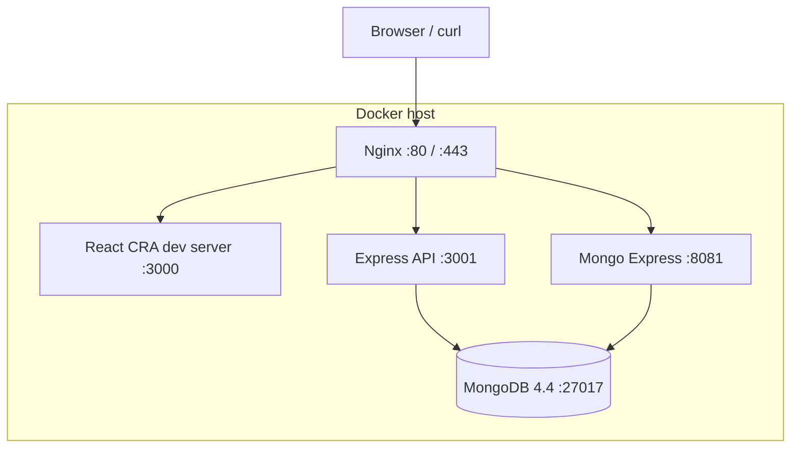

# Project Roadmap — Automatic Deployment with Docker & Ansible

This document tracks the gap analysis and execution plan for `HW_L5_03` (see `[assignment.md](./assignment.md)`). It maps the current state of the repository to the 10 required phases and defines who does what next.

Status legend: ❌ Not started · 🟡 Partial · ✅ Done

---

## 1. Current State vs. Assignment


| Phase                     | Requirement                                                       | Status                                                                                                                                            |
| ------------------------- | ----------------------------------------------------------------- | ------------------------------------------------------------------------------------------------------------------------------------------------- |
| 1 – Environment           | Provision Ubuntu 22.04 server, document specs                     | ❌ Not started (no `01_environment/`)                                                                                                              |
| 2 – Ansible prep          | Inventory + `server_setup.yml` playbook                           | ❌ Not started — no Ansible content exists anywhere in the repo                                                                                    |
| 3 – Select GitHub project | Clone an external app with FE+BE+DB                               | ⚠️ Ambiguous — repo has a **custom-built** app instead (see Decision #1)                                                                          |
| 4 – Dockerfile/Compose    | `04_docker/*` + explanations + test evidence                      | 🟡 Partial — `backend/Dockerfile`, `frontend/Dockerfile`, `docker-compose.yaml` exist and mostly work, but have bugs and no docs/logs             |
| 5 – Deploy on server      | Manual deploy + logs from real host                               | ❌ Not started (needs Phase 1 server)                                                                                                              |
| 6 – Nginx                 | Plain HTTP reverse proxy on local test domain                     | 🟡 Partial — `nginx/default.conf` exists but skips straight to SSL, missing proxy headers                                                         |
| 7 – TLS/SSL               | Self-signed cert + HTTPS Nginx config                             | 🟡 Partial — `openssl.sh` generates a self-signed cert, but `nginx/default.conf` is wired to Let's Encrypt paths instead, so they're disconnected |
| 8 – Ansible automation    | `deploy_app.yml`, `deploy_nginx.yml`, `site.yml`, Jinja2 template | ❌ Not started at all                                                                                                                              |
| 9 – Documentation         | README, architecture, deployment & troubleshooting guides         | ❌ Not started                                                                                                                                     |
| 10 – Final delivery       | Git repo, history, summary, structure, contributions              | ❌ Not started — no `.git` initialized yet                                                                                                         |


---


## 2. Architecture Snapshot (current)




Services: `web` (frontend, build ctx `frontend/`), `api` (backend, build ctx `backend/`), `db` (mongo:4.4), `mongoExpress`, `nginx`. This is a solid foundation — most of Phase 4's *design* work is already done.

---


## 3. Decisions Needed From the Team

1. **Phase 3 scope**: Treat this existing custom app as "the selected project" (fast — push it to GitHub, document it as our own build), or actually clone a separate sample repo (e.g. from `docker/awesome-compose`) to dockerize from scratch, per the literal assignment text?
  - **Recommendation**: Option A, given how much is already built. Confirm with instructor if using our own app is acceptable.
2. **Infra choice (Phase 1)**: VirtualBox/VMware VM or a rented VPS?
3. **Local test domain (Phase 6)**: Proposed `daneshkar.local` unless the team prefers another name.
4. **TLS scope (Phase 7)**: Assignment wants a **self-signed** cert as the graded deliverable. `certbot.sh` (Let's Encrypt) requires a real public domain, so it stays as a documented production alternative rather than the primary graded config.

---


## 4. Bugs & Hardening Items Found in Existing Code

| # | Issue | Status | Fix |
|---|---|---|---|
| 1 | `backend/Dockerfile` had a typo'd, redundant global `nodemon` install (`--froce`) | ✅ Fixed | Removed the line. `CMD` now runs `node index.js` directly, matching what `docker-compose.yaml` already overrides it to in production. `nodemon` is still a local dependency and can be run via `npx nodemon index.js` for ad-hoc dev use. |
| 2 | MongoDB port `27017` was published to the host | ✅ Fixed | Changed `ports:` to `expose:` in `docker-compose.yaml` — only reachable by other containers on the compose network now. |
| 3 | Hardcoded credentials (`pass123`, `sarvinpass`) in `docker-compose.yaml` | ✅ Fixed | Added `.env` (real values, git-ignored) and `.env.example` (committed template). Compose now reads `${MONGO_ROOT_USER}`, `${MONGO_ROOT_PASSWORD}`, `${MONGO_EXPRESS_USER}`, `${MONGO_EXPRESS_PASSWORD}`. |
| 4 | No healthchecks, inconsistent `restart` policies | ✅ Fixed | Added a Mongo healthcheck (authenticated `mongo --eval` ping); `api` and `mongoExpress` now wait on `db` via `condition: service_healthy`; all five services use `restart: unless-stopped`. |
| 5 | `mongo.yaml` duplicated `db`/`mongoExpress` and conflicted on port `27017` | ✅ Fixed | Moved to `experiments/mongo-standalone.yaml` with a header comment clarifying it's a standalone scratch file, not part of the deployed stack. |
| 6 | `nginx/default.conf` missing `proxy_set_header` (`Host`, `X-Real-IP`, `X-Forwarded-For`, `X-Forwarded-Proto`), no `ssl_protocols`/`ssl_ciphers`, no error handling | ✅ Fixed | Added shared `nginx/proxy_params.conf` (headers + timeouts), included by every `location` block, plus `ssl_protocols`/`ssl_ciphers`/`ssl_prefer_server_ciphers` hardening and a basic 502/503/504 handler. The domain-name + self-signed-cert rework (Phase 6/7 redesign, pending Decision #3/#4) is still tracked separately in Section 6. |
| 7 | No `.gitignore`, no `.git` repo initialized | 🟡 Partially fixed | Added `.gitignore` (node_modules, `.env`, build output, TLS key material, logs). `git init` + first commit still pending — see Quick wins below. |
| 8 | `frontend/Dockerfile` runs the CRA dev server instead of a production build | ⏭️ Deferred | Acceptable for this assignment's scope; left as an optional stretch goal (multi-stage build) rather than a required fix. |

---


## 5. Target Final Structure

Keep real runtime code where it already sensibly lives (`backend/`, `frontend/`, `nginx/`, `docker-compose.yaml`) and add the assignment's numbered deliverable folders around it:

```
DaneshkarTeamProject/
├── README.md
├── roadmap.md
├── .gitignore
├── .env / .env.example
├── docker-compose.yaml
├── nginx/ (default.conf, proxy_params.conf)
├── backend/ (Dockerfile, .dockerignore, index.js, ...)
├── frontend/ (Dockerfile, .dockerignore, src/, ...)
├── openssl.sh / certbot.sh
├── experiments/mongo-standalone.yaml
├── 01_environment/        server_info.md, connection_server.txt
├── 02_ansible_setup/      inventory, ping_test.txt, facts.txt, server_setup.yml, playbook_output.txt, verification.txt
├── 03_project_clone/      project_structure.txt, project_info.md
├── 04_docker/             dockerfile_explanation.md, compose_explanation.md, build_log.txt, container_status.txt, test_results.txt
├── 05_deployment/         deploy_log.txt, container_status.txt, container_logs.txt, test_results.txt
├── 06_nginx/              nginx_config.txt, nginx_explanation.md, hosts_file.txt, nginx_test_results.txt
├── 07_ssl/                certificate_info.txt, nginx_ssl_config.txt, test_results.txt
├── 08_ansible_automation/ deploy_app.yml, app_vars.yml, deploy_nginx.yml, nginx_vars.yml, templates/nginx.conf.j2, site.yml, playbook_output.txt, verification.txt
├── 09_documentation/      architecture.md, deployment_guide.md, troubleshooting.md
└── 10_delivery/           git_history.txt, project_summary.md, final_structure.txt, team_contribution.md
```

> If the instructor requires Dockerfiles to literally live under `04_docker/`, add copies there too — currently planned to keep a single source of truth in `backend/`/`frontend/` and document it in `04_docker/dockerfile_explanation.md`.

---


## 6. Phase-by-Phase Plan — Who Does What

Each phase below is split into work the **agent can author directly** (no live server needed) vs. work that **requires the team on real infrastructure** (provisioning, SSH, live command output).

### Quick wins (agent, no server needed)
- [x] Add `.gitignore`, `.env` + `.env.example`, refactor `docker-compose.yaml` to use them
- [x] Fix the `backend/Dockerfile` typo/redundant line
- [x] Un-publish Mongo's host port, add healthchecks/restart policies
- [ ] `git init` + first commit


### Phase 1 — Environment (team)

- [ ] Stand up the Ubuntu 22.04 VM/VPS, record IP + credentials
- [ ] SSH in, run `uname -a`, `lsb_release -a`, `df -h`, `free -h`, `ip a` → paste into `01_environment/connection_server.txt`
- [ ] Agent preps `server_info.md` / `connection_server.txt` templates to fill in


### Phase 2 — Ansible prep

- [ ] Agent authors `02_ansible_setup/inventory` (INI, with `ansible_host`, `ansible_user`, `ansible_python_interpreter`)
- [ ] Agent authors `server_setup.yml` (apt update/upgrade, install curl/wget/git/vim/htop/ufw, install Docker + Compose plugin, enable docker service, add user to `docker` group, install/start nginx, `ufw` rules for 22/80/443)
- [ ] Team runs `ansible all -m ping`, `ansible all -m setup`, `ansible-playbook server_setup.yml` against the real host, saves output into `ping_test.txt`, `facts.txt`, `playbook_output.txt`, `verification.txt`


### Phase 3 — Project selection

- [ ] Confirm Decision #1
- [ ] Agent authors `project_info.md` and `project_structure.txt` describing the app (React + Express + MongoDB + Mongo Express + Nginx, ports 3000/3001/27017/8081/80/443)


### Phase 4 — Dockerfile/Compose

- [ ] Agent applies fixes from Section 4, authors `dockerfile_explanation.md` (line-by-line for both Dockerfiles) and `compose_explanation.md`
- [ ] Team runs `docker compose build`, `docker compose up -d`, `docker compose ps`, `docker compose logs`, curl tests → paste into `build_log.txt`, `container_status.txt`, `test_results.txt`


### Phase 5 — Deploy on server (team, needs Phase 1 host)

- [ ] Transfer files — recommend `git clone` directly on the server (cleanest, one of the assignment's four accepted methods)
- [ ] Run compose on the server, capture logs/status/curl tests from both server and local machine


### Phase 6 — Nginx

- [ ] Agent reworks `nginx/default.conf` — plain HTTP on port 80, `server_name daneshkar.local`, proper `proxy_set_header` block, `location` blocks for `/`, `/api/`, `/mongo/`, basic error handling
- [ ] Team places it in `sites-available`, symlinks to `sites-enabled`, disables default site, runs `nginx -t`, reloads, edits local `/etc/hosts`, tests with `curl http://daneshkar.local`


### Phase 7 — TLS/SSL

- [ ] Agent updates `openssl.sh` (add SAN/CN for `daneshkar.local`) and writes the SSL-enabled Nginx config (443, `ssl_protocols TLSv1.2 TLSv1.3`, hardened ciphers, HTTP→HTTPS redirect)
- [ ] Team generates the cert on the server, runs `nginx -t`, reloads, tests with `curl -Lk` → capture into `certificate_info.txt` / `test_results.txt`


### Phase 8 — Ansible automation (agent authors entirely; biggest missing chunk)

- [ ] `deploy_app.yml`: create app dir, git-clone/pull the repo on the server, `docker compose build` + `up -d`, verify with `wait_for` + `uri` module
- [ ] `app_vars.yml`: app dir path, repo URL, env values
- [ ] `deploy_nginx.yml`: create SSL dir, generate self-signed cert, template the config, enable site, disable default, reload via handler
- [ ] `templates/nginx.conf.j2`: Jinja2 version of the Phase 6/7 config, parameterized by domain/ports
- [ ] `site.yml`: `import_playbook` for `server_setup.yml` → `deploy_app.yml` → `deploy_nginx.yml`
- [ ] Team runs the playbooks end-to-end, captures `playbook_output.txt` / `verification.txt`


### Phase 9 — Documentation

- [ ] Agent authors `README.md`, `architecture.md` (with diagram + Ansible control-node flow), `deployment_guide.md`, `troubleshooting.md` using real details from the stack, with placeholders only where real server-specific output is needed


### Phase 10 — Final delivery (team, after everything above)

- [ ] Agent does `git init` + `.gitignore` + first commits; team owns the GitHub/GitLab remote and final push
- [ ] Capture `git log --oneline --graph` → `git_history.txt`
- [ ] Capture `tree`/`find` output → `final_structure.txt`
- [ ] Write `project_summary.md` and `team_contribution.md` with real reflections/names

---


## 7. Suggested Team Split

- **Member A** — Docker track: Phase 4 hardening, Phase 5 manual deploy, Phase 6/7 Nginx+SSL
- **Member B** — Ansible track: Phase 2 and Phase 8 playbooks
- **Everyone** — Phase 1 (whoever owns the server), Phase 9/10 docs as a group

---


## 8. Next Step

Start with the **Quick wins + Phase 4 hardening + Phase 8 Ansible authoring + Phase 9 docs draft** — all doable without touching real infrastructure. The infra-dependent phases (1, 2 execution, 5, 7 execution, 8 execution, 10) need the team to run the provided commands/playbooks and record the output into the corresponding files.